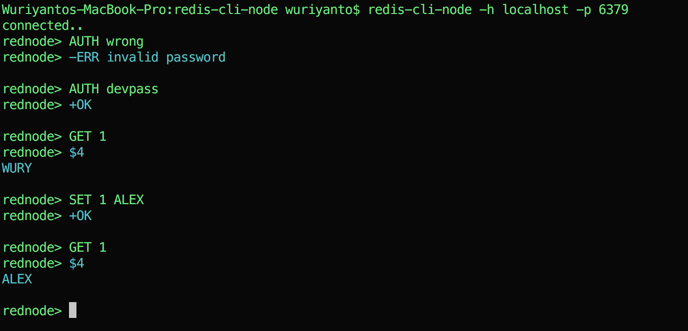

## redis-cli-node

Redis CLI written in Nodejs

#### TODO

- Better output
- Handle connection error when `host or IP address` is invalid

### Usage
#### Development mode

The npm link command allow us to locally ‘symlink a package folder’, and for our needs, it will locally install any command listed in the bin field of our package.json.

The npm link command is used from within the NodeJS package directory we want to symlink:

```shell
$ npm link
```

to uninstall
```shell
$ npm unlink
```

Now we can executed from anywhere

```shell
$ redis-cli-node -h localhost -p 6379
```

<div align="center">

[](https://github.com/telkomdev/redis-cli-node)
<br/><br/>
</div>